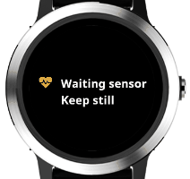

# Test HRV

A Garmin app that measures [HRV](https://en.wikipedia.org/wiki/Heart_rate_variability)(Heart Rate Variability) in a 3 minute test. Saves the output as a Connect IQ activity.

## Measurements

- [HRV](https://en.wikipedia.org/wiki/Heart_rate_variability)(Heart Rate Variability)
    - RMSSD - Root Mean Square of Successive Differences (beat-to-beat intervals)
    - pNN20 - % of successive beat-to-beat intervals that differ by more than 20 ms
    - pNN50 - % of successive beat-to-beat intervals that differ by more than 50 ms
    - beat-to-beat interval - reading coming directly from the watch sensor
    - HRV Successive Differences - difference between current and previous beat-to-beat intervals
    - SDRR - [Standard Deviation](https://en.wikipedia.org/wiki/Standard_deviation) of beat-to-beat intervals      
    - HRV RMSSD 30 Sec Window - RMSSD calculated for consecutive 30 second intervals    
    - HR from heartbeat - beat-to-beat interval converted to HR
- HR(Heart Rate)
  - minimum
  - average
  - maximum

## [Download](https://apps.garmin.com/en-US/apps/0bdc0e75-9baa-417a-8c9f-e976662a5d2e)

## Dependencies

- Status Icons - [Font Awesome free](https://fontawesome.com/license) (SIL OFL 1.1 License) 
